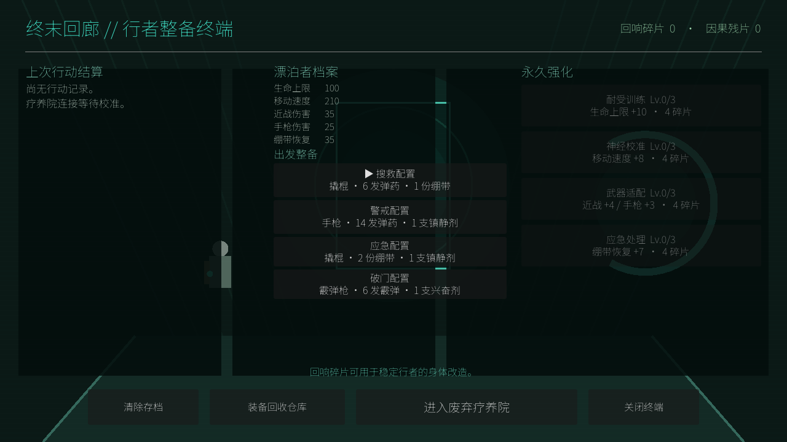
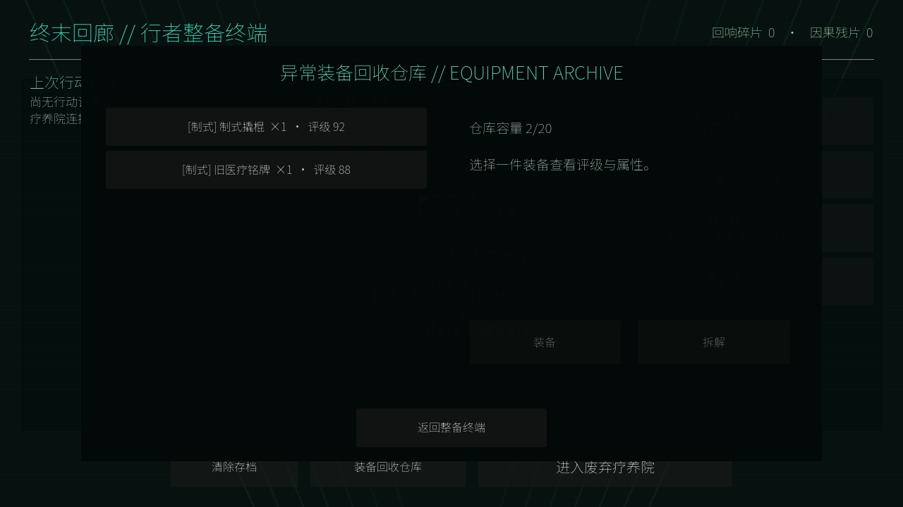
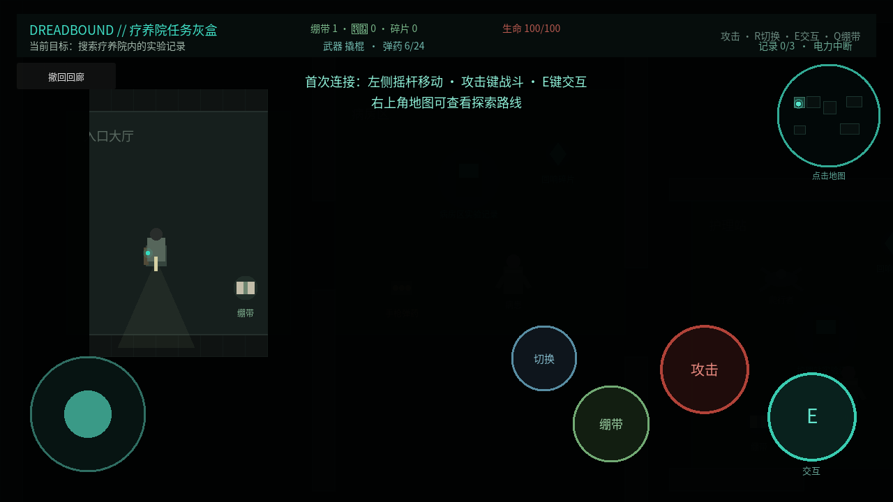

# Dreadbound

**Dreadbound** 是一款使用 Godot 4 与 GDScript 开发的原创单机 2D 俯视角恐怖生存 Roguelite。玩家作为被“终末回廊”选中的行者，进入由文明恐惧、记忆和未来可能性生成的灾难世界，探索、战斗、管理资源、修复异常并决定何时撤离。

项目只借鉴“无限流”题材中进入不同危险世界并成长的结构，不使用现有作品的角色、专有名词、剧情、电影副本或具体强化内容。

## 项目定位

- 引擎与脚本：Godot 4、GDScript
- 模式与视角：单机、2D 俯视角、四方向移动
- 首要平台：电脑浏览器 Web；后续支持 Windows 下载版
- 设计分辨率：1280×720；场景 Tile：32×32 像素
- 视觉方向：写实人体比例的低分辨率恐怖像素风

## 当前阶段

项目处于**首个垂直切片完成与持续世界验证阶段**。新存档首次打开会直接进入疗养院教学局，成功撤离后解锁终末回廊；已有成功记录的存档会从回廊开始。副本中可以主动撤回，并包含风险事件、人性洞察和跨局因果选择。地图二“潮没末班线”已经具备首个持续叙事闭环：失踪乘客会记住玩家，二刷与三刷根据承诺、背叛和救援加载不同章节，并可永久开启隐藏的“失踪乘客维护层”。

当前持久叙事能力包括：

- 副本访问、结局、隐藏区域、Boss 阶段与剧情事件记忆；
- NPC 生死、位置、信任、承诺和身份变化；
- 一刷、二刷、三刷的确定性剧情变体；
- Boss 遗物与剧情物品的世界唯一注册；
- 两件 Boss 成长遗物具备五级实战形态：缝合镰扩大近战范围并解锁击退、寒霜定身，导轨枪延长射程并解锁贯穿、击退、电磁麻痹；外形与命中特效同步成长；
- 行动档案显示“这次变化来自哪一次选择”；
- v19 存档与旧存档自动迁移。

L0–L5 Human Mirror Loop 已接入：回廊新增独立“人性镜鉴”，知识库扩展为 40 条可审计行为科学条目，两张副本均有长期 NPC 与二刷变化，高压事件会记录真实行为代价，危险/深渊难度会生成带“精英、变异、狂化、冻蚀、共鸣、噩梦”等可见词缀与实战能力的敌人。副本章节、NPC、行为事件和怪物词缀已迁入统一内容目录并在运行前校验。存档版本为 v19，兼容旧档。

完整实现边界见 [`docs/human-mirror-loop-l0-l5.md`](docs/human-mirror-loop-l0-l5.md)。

M0–M6 Exchange & Evolution Loop 已接入：终末回廊开放异常兑换、六种世界材料、确定性轮换、三件合成三选一、结果锁定、合成余烬与保底；三职业扩展为十二战斗流派，装备支持五级强化与行为条件进化，人性行为会进一步形成不可购买的个人心相。

V21 Loot & Hub 已接入：普通怪、精英、Boss、隐藏来源与撤离奖励统一使用数据化掉落目录；材料先局内暂存、成功撤离后进入独立材料背包，稀有材料有击杀保底，唯一藏品继续受世界唯一注册保护。回廊已拆成装备、材料、唯一藏品、档案、职业、副本、终端七个同级入口。存档版本升级为 v21，并兼容 v20 及更早版本。

完整实现边界见 [`docs/exchange-evolution-loop-m0-m6.md`](docs/exchange-evolution-loop-m0-m6.md)。

掉落表、分类背包与回廊信息架构见 [`docs/loot-inventory-hub-v21.md`](docs/loot-inventory-hub-v21.md)。

详细设计与扩展边界见 [`docs/persistent-narrative-dungeon.md`](docs/persistent-narrative-dungeon.md)。

## 运行目标

安装 Godot 4 后，在 Project Manager 中导入 `project.godot` 并按 **F5**，或运行 `godot --path .`。电脑使用 WASD/方向键移动、空格/J 攻击、R/Tab 切换武器、F 切换道具、Q 使用当前道具、E 交互；手机和平板使用左侧摇杆及右侧攻击、武器切换、道具切换、当前道具和交互按钮。当前选中的道具及数量会显示在顶部状态栏与道具按钮中。建议横屏游玩。

首个可玩目标是一局 10～15 分钟的废弃疗养院垂直切片：寻找三份实验记录、恢复地下室电力，并在怪物追击下撤离。









## 开发路线

1. **最小框架（完成）**：项目配置、文档、占位启动场景。
2. **任务灰盒（完成）**：已完成四方向移动、碰撞、相机、手机触控、疗养院分区、三份记录、供电与撤离流程。
3. **最小战斗闭环（完成）**：玩家生命与受击、基础近战攻击、The Patient 追击与扑击、死亡与重开。
4. **探索地图（完成）**：未探索房间迷雾、进入后渐显、右上角小地图和可展开全图。
5. **资源管理（完成）**：玩家与敌人独立场景、绷带、回响碎片、自动拾取和简化物品状态。
6. **内容扩展（完成）**：The Crawler、基础手枪、近战/远程切换和弹药资源。
7. **终末回廊闭环（完成）**：撤离结算、局外资源账户、角色属性、4 项永久强化、三套简化整备、存档和再次出发。
8. **风险事件（完成）**：污染药柜与回响病房，包含补给/伤害和碎片/敌袭的风险收益选择。
9. **疗养院战斗内容（完成）**：The Orderly、供电后苏醒的“缝合主任”Boss、蓄力预警、阶段变化与可绕行撤离。
10. **装备内容（完成）**：霰弹枪、霰弹拾取、镇静剂和第四套“破门配置”，补齐 3 种武器与 3 种消耗品。
11. **引导与表现（完成）**：首局中文提示、关键任务通知、低成本手电筒、电力环境变化、合成反馈音和统一终端 UI。
12. **平衡与稳定性（完成首轮）**：敌人分工、移动端安全布局、减少拾取物重绘、WebGL 恢复与 v1→v2 存档迁移。
13. **完整回归（完成自动化）**：任务、战斗、地图、资源、事件、成长、Boss、三武器和三消耗品均进入部署门禁；真实设备仍需每次发布后持续烟雾测试。
14. **阶段 G 奖励基础（完成）**：普通怪物掉落、Boss 三选一回收箱、8 件样品装备、4 档品质、仓库、装备、拆解和撤离入库。
15. **动态副本框架 H1（完成）**：带种子的房间模块重组、任务插槽、可达性验证、小地图适配与行动代码复现。
16. **动态任务与 AI 导演 H2–H4（完成首轮）**：支线条件、因果链、压力/节奏导演、敌人记忆和 500 种子回归。
17. **第二个灾难世界（完成首轮）**：潮没末班线已接入双契约、潮位/噪音/车次、双路线撤离、专属敌人和 Boss、四件机制装备与阈值司仪试炼；后续发布继续执行桌面与真实移动设备烟雾测试。所有世界必须遵守共享的 [UI 开发与验收标准](docs/ui-development-standard.md)，不得复制固定坐标界面。
18. **潮没末班线 H5（完成自动化）**：检票员会响应噪音调查并拦截非撤离连接；末班列车阶段读取潮位、车次和信号锚；站务员哨支持键盘/触控主动诱敌；司仪报告显示可追溯行为依据。真实设备平衡仍属于发布烟雾测试。
19. **阶段 I1–I3（完成自动化）**：三职业机制节点、统一状态/冷却/异化显示、范围预览、v9→v10 存档迁移、按职业/世界行动统计、单次有限重构与 500 种子平衡回归已接入；真实玩家平衡数据继续随发布积累。
20. **阶段 U1–U4（完成代码与本地回归）**：首次世界/Boss 因果里程碑、本地多昵称档案、旧单档迁移、可选账号登录、云存档 revision 冲突处理、游客绑定、离线回退与账号删除已实现；云功能需部署 `backend/` 服务并配置 HTTPS API，未配置时保持纯本地单机体验。
21. **阶段 J0（持续世界底座完成首轮）**：存档升级至 v16；新增结构化行动事件账本、独立持续世界状态与幂等因果规则引擎。每局开始、风险选择和最终结算会形成可追溯事件，驱动阵营信任、区域安全/污染与世界周期；v15 及更早存档会自动补齐默认状态。
22. **阶段 J1–J3（人性洞察完成首轮）**：存档升级至 v17；新增非临床行为科学知识库、六维证据画像、人性回声、确定性四阵营世界回合和阈值司仪 v2。所有推断包含事件依据、相反证据、置信度与知识引用，AI 不得脱离账本主观定性。
23. **阶段 J4–J6（社会系统底层完成首轮）**：新增可跨局兑现/背弃承诺的单人阵营情境、异步社区行动包与每周阵营聚合，以及 2–4 人服务器权威房间、命令序列、幂等重试、战利品归属、快照与重连协议。最终多人地图与匹配体验将在该底层之上继续制作。

详见 [`docs/game-vision.md`](docs/game-vision.md)、[`docs/humanity-intelligence-and-social-roadmap.md`](docs/humanity-intelligence-and-social-roadmap.md)、[`docs/art-style.md`](docs/art-style.md)、[`docs/first-vertical-slice.md`](docs/first-vertical-slice.md)、[`docs/progression-roadmap.md`](docs/progression-roadmap.md)、[`docs/pre-second-map-plan.md`](docs/pre-second-map-plan.md)、[`docs/loot-and-progression-plan.md`](docs/loot-and-progression-plan.md)、[`docs/dynamic-director-plan.md`](docs/dynamic-director-plan.md) 和 [`docs/second-disaster-world-design.md`](docs/second-disaster-world-design.md)。

## Web 版本

项目包含 Web 导出预设。安装与当前 Godot 版本匹配的 Export Templates 后，可以运行：

```bash
godot --headless --path . --export-release Web builds/web/index.html
python3 -m http.server 8000 --directory builds/web
```

然后访问 `http://localhost:8000`。`.github/workflows/deploy-web.yml` 会在 `main` 分支更新时构建并部署 GitHub Pages；首次使用需要在仓库 **Settings → Pages → Source** 中选择 **GitHub Actions**。

线上试玩固定地址为 <https://ancientboy.github.io/Dreadbound>。后续发布说明始终使用这个地址，不附加提交编号或查询参数。
