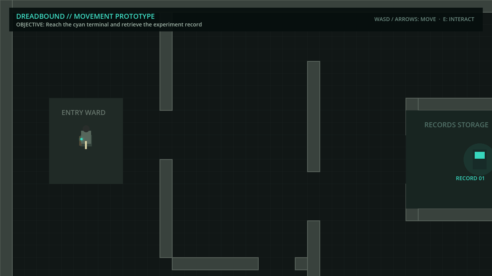
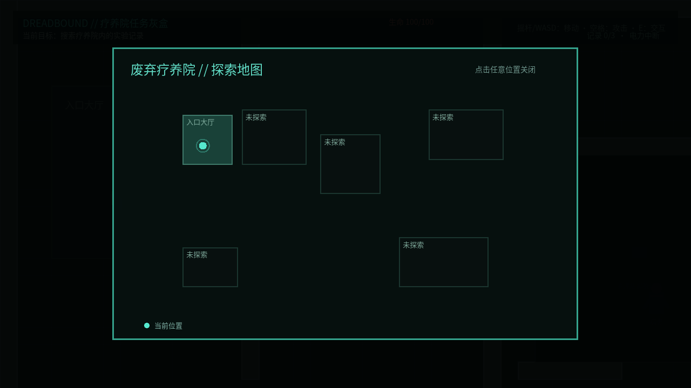
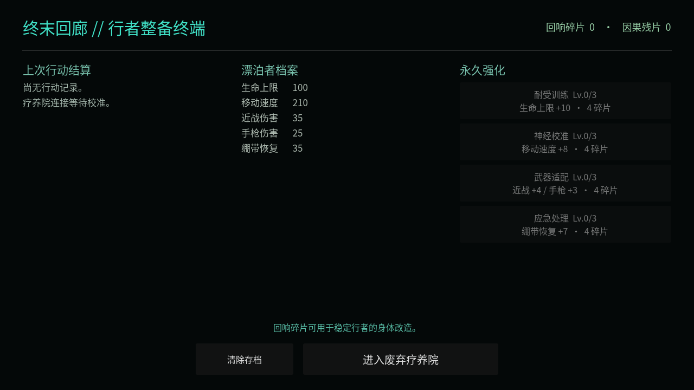
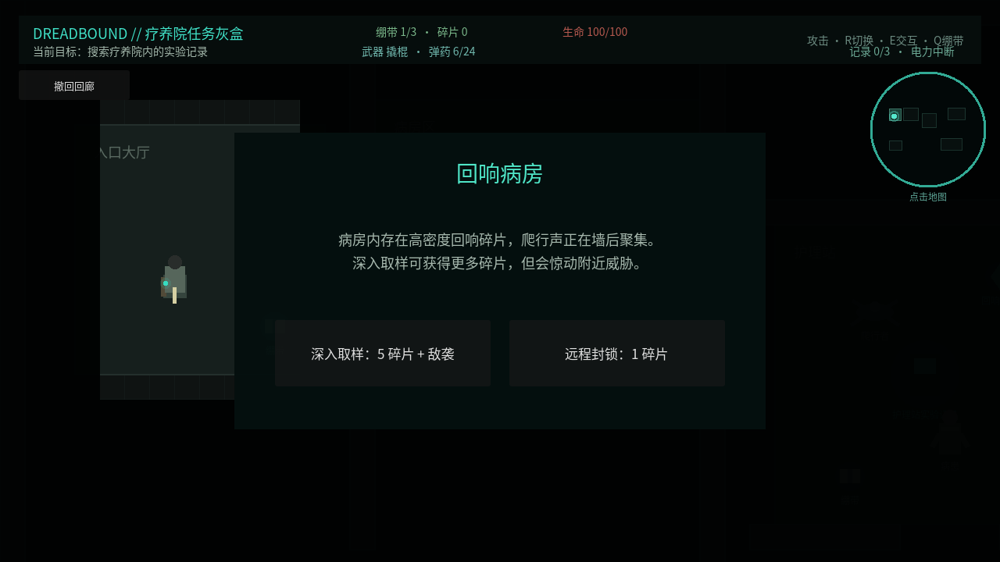

# Dreadbound

**Dreadbound** 是一款使用 Godot 4 与 GDScript 开发的原创单机 2D 俯视角恐怖生存 Roguelite。玩家作为被“终末回廊”选中的行者，进入由文明恐惧、记忆和未来可能性生成的灾难世界，探索、战斗、管理资源、修复异常并决定何时撤离。

项目只借鉴“无限流”题材中进入不同危险世界并成长的结构，不使用现有作品的角色、专有名词、剧情、电影副本或具体强化内容。

## 项目定位

- 引擎与脚本：Godot 4、GDScript
- 模式与视角：单机、2D 俯视角、四方向移动
- 首要平台：电脑浏览器 Web；后续支持 Windows 下载版
- 设计分辨率：1280×720；场景 Tile：32×32 像素
- 视觉方向：写实人体比例的低分辨率恐怖像素风

## 当前阶段

项目处于**垂直切片内容扩展阶段**。新存档首次打开会直接进入疗养院教学局，成功撤离后解锁终末回廊；已有成功记录的存档会从回廊开始。副本中可以主动撤回，并包含“污染药柜”和“回响病房”两种风险事件；玩家需要在额外补给、碎片、受伤和敌袭之间作出选择。

## 运行目标

安装 Godot 4 后，在 Project Manager 中导入 `project.godot` 并按 **F5**，或运行 `godot --path .`。电脑使用 WASD/方向键移动、空格/J 攻击、R/Tab 切换武器、E 交互、Q 绷带；手机和平板使用左侧摇杆及右侧攻击、切换、交互、绷带按钮。建议横屏游玩。

首个可玩目标是一局 10～15 分钟的废弃疗养院垂直切片：寻找三份实验记录、恢复地下室电力，并在怪物追击下撤离。









## 开发路线

1. **最小框架（完成）**：项目配置、文档、占位启动场景。
2. **任务灰盒（完成）**：已完成四方向移动、碰撞、相机、手机触控、疗养院分区、三份记录、供电与撤离流程。
3. **最小战斗闭环（完成）**：玩家生命与受击、基础近战攻击、The Patient 追击与扑击、死亡与重开。
4. **探索地图（完成）**：未探索房间迷雾、进入后渐显、右上角小地图和可展开全图。
5. **资源管理（完成）**：玩家与敌人独立场景、绷带、回响碎片、自动拾取和简化物品状态。
6. **内容扩展（完成）**：The Crawler、基础手枪、近战/远程切换和弹药资源。
7. **终末回廊闭环（完成）**：撤离结算、局外资源账户、角色属性、4 项永久强化、三套简化整备、存档和再次出发。
8. **风险事件（完成）**：污染药柜与回响病房，包含补给/伤害和碎片/敌袭的风险收益选择。
9. **疗养院内容补齐**：The Orderly、简单 Boss、第三种武器和剩余消耗品。
10. **表现与平衡**：统一像素素材、灯光和音效、终端风格 UI 及 Web 性能优化。
11. **第二个灾难世界**：仅在首个完整循环稳定后开始，复用已经验证的结算与成长系统。

详见 [`docs/game-vision.md`](docs/game-vision.md)、[`docs/art-style.md`](docs/art-style.md)、[`docs/first-vertical-slice.md`](docs/first-vertical-slice.md) 和 [`docs/progression-roadmap.md`](docs/progression-roadmap.md)。第一阶段不开发多人、3D、复杂队友 AI、程序化地图或大量装备。

## Web 版本

项目包含 Web 导出预设。安装与当前 Godot 版本匹配的 Export Templates 后，可以运行：

```bash
godot --headless --path . --export-release Web builds/web/index.html
python3 -m http.server 8000 --directory builds/web
```

然后访问 `http://localhost:8000`。`.github/workflows/deploy-web.yml` 会在 `main` 分支更新时构建并部署 GitHub Pages；首次使用需要在仓库 **Settings → Pages → Source** 中选择 **GitHub Actions**。
